# SMART CONTRACTS #Truffle #OpenZeppelin 

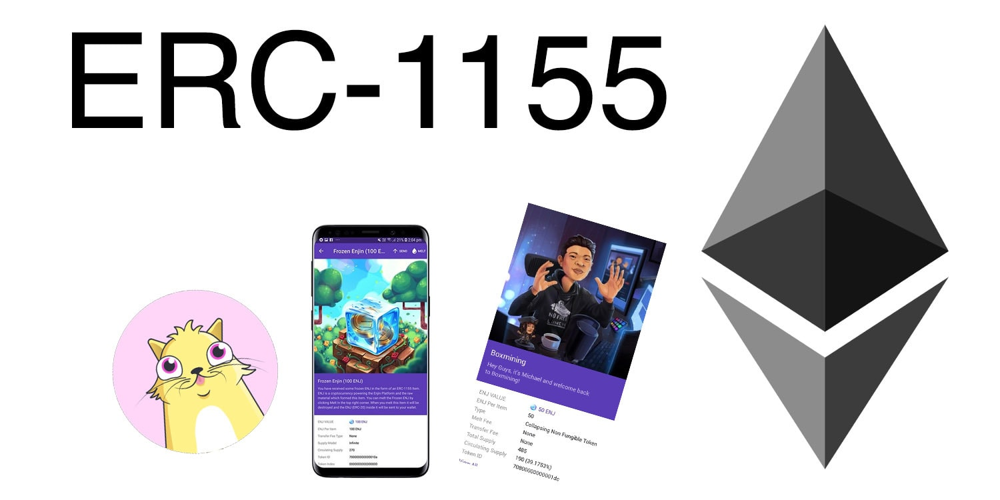

Para esta practica se crearan tokens que cumplan los estandares ERC1155. 

Por lo que comenzamos en cmd ubicando la direccion donde crearemos nuestro proyecto y una vez localizados ahi crearemos nuestros archivos basicos del proyecto mediante los comandos: truffle init, npm init, npm install @openzeppelin/contracts

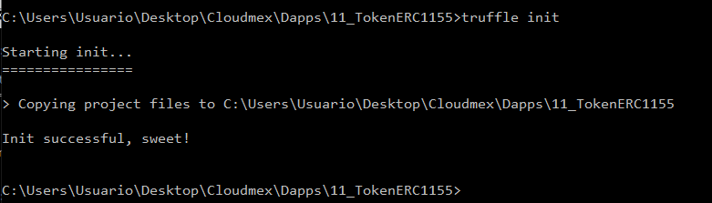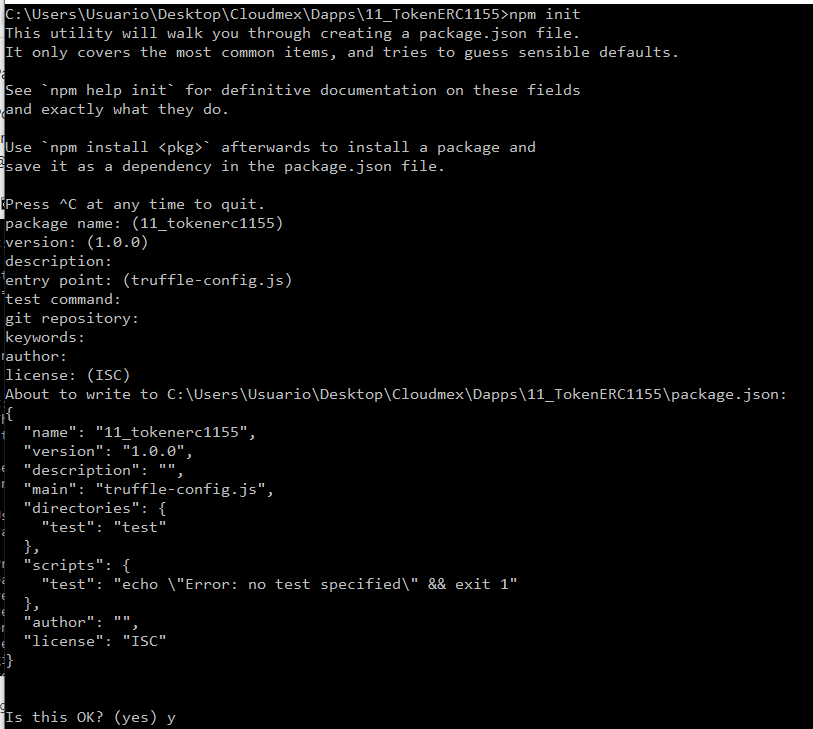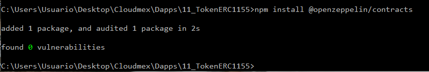

Para poder compilar nuestro archivo el cual cuenta con un estandar ERC1155 debemos usar un compilador con una version 0.6.2 o superior de nuestro pragma por lo que dentro de nuestro archivo "truffle-config" modificamos la version del compilador.

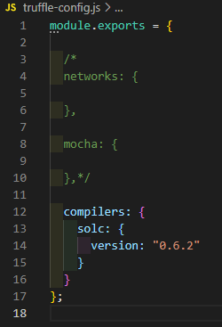

Una vez hecho esto podemos verificar que nuestro smart contract compile correctamente mediante cmd usando el comando "truffle compile", si todo es correcto este nos generara automaticamente una carpeta llamada build/contracts con sus respectivos json.

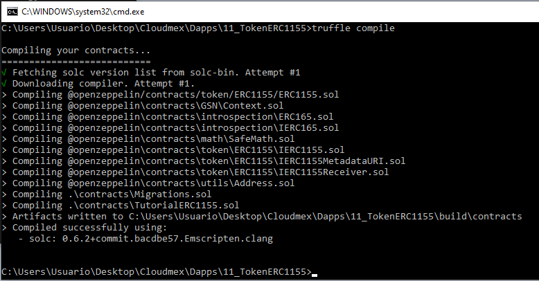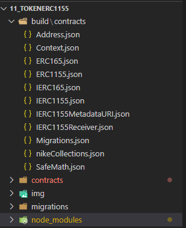

Ahora para realizar esta prueba podemos crear en nuestra carpeta test un archivo de prueba, pero para este ejercicio realizaremos ese testeo en remix.ethereum.org que es nuestro IDE en linea, por lo que copiamos y pegamos nuestro archivo TutorialERC1155.sol y lo compilamos.

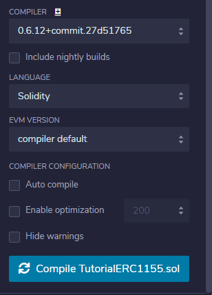

Una vez compulado en remix.ethereum abriremos nuestro metamask y seleccionaremos la red Ropsten para simular un trabajo en la main net

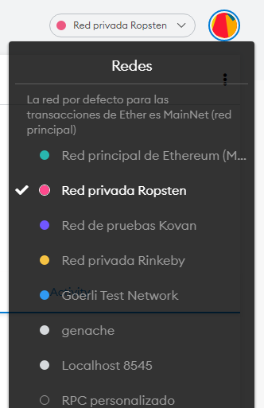

Ahora dentro de nuestro remix.ethereum ingresamos a la ventana de Deploy and Run, seleccionamos como ambiente Injected Web3 para hacer uso de la red Ropsten, copiamos y pegamos nuestra cuenta de metamask en el campo del IDE y damos Deploy

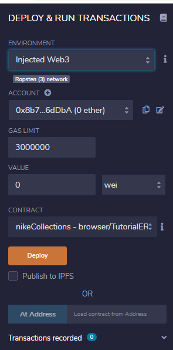

Una vez realicemos esto, veremos como nuestro metamask abre una ventana en la que nos esta mostrando el cobro por crear el smart contract, solo damos confirmar y veremos como nos ha hecho el descuento y tras esperar unos segundos nos aparecera en el historial de actividad que se desplego el contrato.

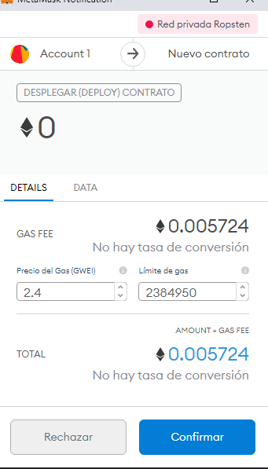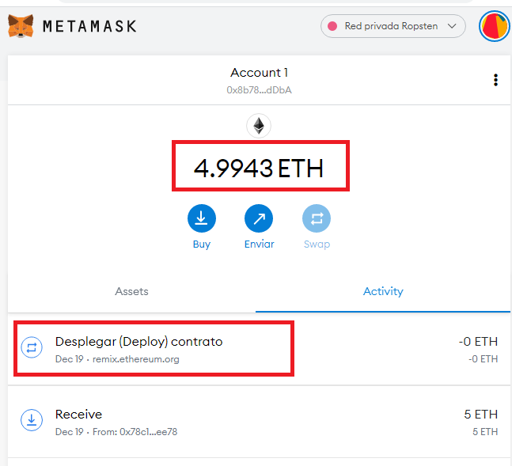

Ahora verificamos que las funciones de nuestro contrato esten activas, en la parte inferior de Deploy and Run veremos todas las funciones de nuestro contrato (a pesar de que solo creamos dos funciones en nuestro archivo .sol las demas funciones se generan automaticamente porque estamos referencianco a las funciones con las que ya cuenta el estandar ERC1155)

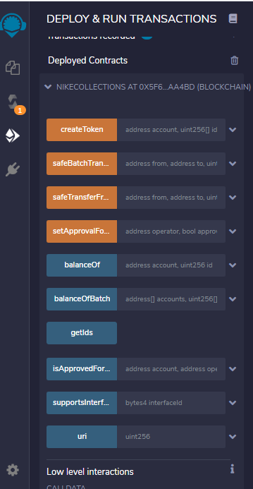

Para crear un token solamente llenamos la informacion correspondiente a la funcion createToken, damos clic en transact y listo. (en ocasiones mostrara mensaje de gas estimated failes si nuestra cuenta de metamask no tiene suficiente ETH, o si arriba en la configuracion neustro limite de gas es muy poco, etc.)

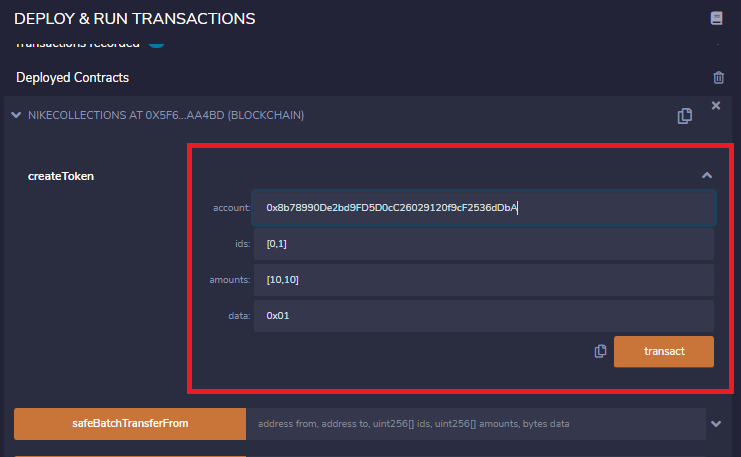

Tutorial original : https://medium.com/deabit/solidity-tutorial-multi-standard-token-erc-1155-25bf2c0a270e